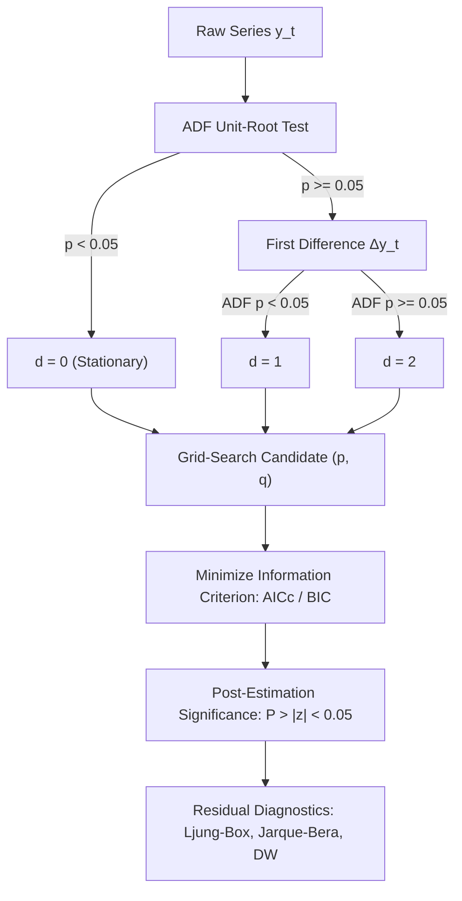

# SutteARIMA: Hybrid Time Series Forecasting for Econometrics

[](https://www.python.org/downloads/)
[](https://opensource.org/licenses/MIT)

**SutteARIMA** is a specialized time series forecasting library that combines the non-parametric **$\alpha$-Sutte Indicator** (Ahmar, 2017) with the classical parametric **Box-Jenkins ARIMA/SARIMAX** model (Ahmar et al., 2019).

Designed with a clean, **statsmodels-compliant API** for econometricians, statisticians, and quantitative analysts—delivering maximum statistical rigor with minimal code.

---

## Table of Contents
1. [Installation](#installation)
2. [Model Overview & Mathematical Background](#model-overview--mathematical-background)
   - [The $\alpha$-Sutte Indicator](#1-the-alpha-sutte-indicator)
   - [The Box-Jenkins ARIMA Model](#2-the-box-jenkins-arima-model)
   - [The Hybrid SutteARIMA Formulation](#3-the-hybrid-suttearima-formulation)
3. [Econometric Order Selection Methodology](#econometric-order-selection-methodology)
4. [Evaluation Criteria Reference & How to Call Them](#evaluation-criteria-reference--how-to-call-them)
   - [Information Criteria (Model Selection)](#a-information-criteria-model-selection)
   - [Residual Diagnostic Tests](#b-residual-diagnostic-tests)
   - [Forecast Accuracy Metrics](#c-forecast-accuracy-metrics)
5. [Complete End-to-End Example](#complete-end-to-end-example)

---

## Installation

```bash
pip install --upgrade git+https://github.com/BahmanOrujov/sutte-ARIMA.git
```

### Dependencies
- `numpy >= 1.20`
- `pandas >= 1.2`
- `scipy >= 1.6`
- `statsmodels >= 0.12`
- `matplotlib` *(optional, for visual diagnostics)*

---

## Model Overview & Mathematical Background

Traditional ARIMA models rely entirely on linear lag polynomials and differencing, which can struggle with rapid regime shifts and non-linear short-run momentum. The **SutteARIMA** framework overcomes this by combining parametric Box-Jenkins dynamics with the adaptive, non-parametric **$\alpha$-Sutte** indicator.

### 1. The $\alpha$-Sutte Indicator

Developed by Dr. Ansari Saleh Ahmar (2017), the $\alpha$-Sutte indicator calculates dynamic relative changes across the four most recent historical periods $(y_{t-4}, y_{t-3}, y_{t-2}, y_{t-1})$:

1. **Successive Differences**:
   $$\Delta x = y_{t-3} - y_{t-4}, \quad \Delta y = y_{t-2} - y_{t-3}, \quad \Delta z = y_{t-1} - y_{t-2}$$

2. **Sub-period Midpoints**:
   $$m_x = \frac{y_{t-3} + y_{t-4}}{2}, \quad m_y = \frac{y_{t-2} + y_{t-3}}{2}, \quad m_z = \frac{y_{t-1} + y_{t-2}}{2}$$

3. **Dynamic Step Increments**:
   $$\tau_x = y_{t-3} \cdot \left(\frac{\Delta x}{m_x}\right), \quad \tau_y = y_{t-2} \cdot \left(\frac{\Delta y}{m_y}\right), \quad \tau_z = y_{t-1} \cdot \left(\frac{\Delta z}{m_z}\right)$$

4. **Aggregate Change ($\Delta_t$) and Prediction**:
   $$\Delta_t = \frac{\tau_x + \tau_y + \tau_z}{3}$$
   $$\hat{Z}_t^{\alpha\text{-Sutte}} = y_{t-1} + \Delta_t$$

### 2. The Box-Jenkins ARIMA Model

The univariate Box-Jenkins $\text{ARIMA}(p, d, q)$ specification is expressed in backshift operator notation ($B^k y_t = y_{t-k}$) as:

$$\Phi_p(B) (1 - B)^d y_t = \Theta_q(B) \varepsilon_t$$

Where:
- $\Phi_p(B) = 1 - \phi_1 B - \phi_2 B^2 - \dots - \phi_p B^p$ is the Autoregressive (AR) polynomial.
- $(1 - B)^d$ is the differencing operator of order $d$.
- $\Theta_q(B) = 1 + \theta_1 B + \theta_2 B^2 + \dots + \theta_q B^q$ is the Moving Average (MA) polynomial.
- $\varepsilon_t \overset{\text{iid}}{\sim} \mathcal{N}(0, \sigma^2)$ is Gaussian white noise.

When seasonality of period $s$ is present, the multiplicative seasonal extension $\text{SARIMA}(p,d,q)\times(P,D,Q,s)$ is:

$$\Phi_p(B)\tilde{\Phi}_P(B^s)(1 - B)^d(1 - B^s)^D y_t = \Theta_q(B)\tilde{\Theta}_Q(B^s)\varepsilon_t$$

### 3. The Hybrid SutteARIMA Formulation

The composite forecast combines the two individual models via equal weighting:

$$\hat{Z}_t^{\text{SutteARIMA}} = \frac{\hat{Z}_t^{\text{ARIMA}} + \hat{Z}_t^{\alpha\text{-Sutte}}}{2}$$

---

## Econometric Order Selection Methodology

Finding the appropriate $(p, d, q)$ specification follows the classical **Box-Jenkins stages**:



1. **Integration Order ($d$) via ADF Test**:
   - The Augmented Dickey-Fuller test evaluates $H_0: \text{unit root present (non-stationary)}$.
   - If level $p_{\text{ADF}} < 0.05 \implies d = 0$.
   - If $p_{\text{ADF}} \ge 0.05$, differences series until stationarity is achieved ($d = 1$ or $d = 2$).

2. **Candidate Order Space ($(p, q)$)**:
   - Evaluates combinations of $p \in [0, p_{\max}]$ and $q \in [0, q_{\max}]$.

3. **Small-Sample Corrected Criterion ($\text{AICc}$)**:
   - In finite empirical samples ($n < 200$), standard AIC overfits by selecting excessive lag orders. $\text{AICc}$ introduces an exact finite-sample correction:
     $$\text{AICc} = \text{AIC} + \frac{2k(k+1)}{n - k - 1}$$
   - For asymptotic consistency in identifying the true data-generating process, $\text{BIC}$ can also be selected: `find_order(data, ic="BIC")`.

4. **Principle of Parsimony & Significance ($P > |z| < 0.05$)**:
   - Estimated coefficients must satisfy statistical significance at the 5% level ($p < 0.05$). Insignificant parameters (e.g., $p > 0.05$) should be pruned to avoid variance inflation.

5. **Residual Diagnostic Validation**:
   - Model adequacy requires residuals to be uncorrelated white noise ($p_{\text{Ljung-Box}} > 0.05$, $DW \approx 2.0$) and normally distributed ($p_{\text{Jarque-Bera}} > 0.05$).

---

## Evaluation Criteria Reference & How to Call Them

Every evaluation criterion is accessible directly as an attribute or method on the fitted results object `res`.

### A. Information Criteria (Model Selection)

| Metric | Mathematical Formula | Statistical Interpretation | Python Call |
| :--- | :--- | :--- | :--- |
| **Log-Likelihood** | $\ln \hat{L} = -\frac{n}{2}\ln(2\pi\sigma^2) - \frac{1}{2\sigma^2}\sum \varepsilon_t^2$ | Maximized likelihood of the observed sample | `res.llf` |
| **AIC** | $-2\ln\hat{L} + 2k$ | Minimizes one-step-ahead forecast error variance | `res.aic` |
| **AICc** | $\text{AIC} + \frac{2k(k+1)}{n - k - 1}$ | Finite-sample corrected AIC (prevents lag overfitting) | `res.aicc` |
| **BIC (Schwarz)** | $-2\ln\hat{L} + k\ln(n)$ | Consistent criterion; heavily penalizes extra parameters | `res.bic` |
| **HQIC** | $-2\ln\hat{L} + 2k\ln(\ln(n))$ | Hannan-Quinn criterion; intermediate penalty rate | `res.hqic` |

```python
print(f"AIC: {res.aic:.3f} | AICc: {res.aicc:.3f} | BIC: {res.bic:.3f} | HQIC: {res.hqic:.3f}")
```

---

### B. Residual Diagnostic Tests

| Test | Formula / Description | Null Hypothesis ($H_0$) & Target | Python Call |
| :--- | :--- | :--- | :--- |
| **Durbin-Watson ($DW$)** | $\frac{\sum_{t=2}^n (\hat{e}_t - \hat{e}_{t-1})^2}{\sum_{t=1}^n \hat{e}_t^2}$ | $DW \approx 2.0 \implies$ No first-order autocorrelation | `res.durbin_watson` |
| **Ljung-Box ($Q$)** | $n(n+2)\sum_{k=1}^m \frac{r_k^2}{n - k}$ | $H_0: \text{Residuals are White Noise}$ ($p > 0.05$) | `res.ljung_box` |
| **Jarque-Bera ($JB$)** | $\frac{n}{6}\left(S^2 + \frac{(K - 3)^2}{4}\right)$ | $H_0: \text{Residuals are Normally Distributed}$ ($p > 0.05$) | `res.jarque_bera` |
| **Heteroskedasticity ($H$)** | Variance ratio across sub-samples | $H_0: \text{Residual variance is Homoskedastic}$ ($p > 0.05$) | `res.heteroskedasticity` |

```python
# Check diagnostic results
print("Durbin-Watson:      ", res.durbin_watson)
print("Ljung-Box Test:     ", res.ljung_box)          # {'statistic': ..., 'p_value': ...}
print("Jarque-Bera Test:   ", res.jarque_bera)        # {'statistic': ..., 'p_value': ..., 'skew': ..., 'kurtosis': ...}
print("Heteroskedasticity: ", res.heteroskedasticity) # {'statistic': ..., 'p_value': ...}
```

---

### C. Forecast Accuracy Metrics

All forecasting accuracy metrics are calculated strictly from the **model's actual predictions** (in-sample or out-of-sample):

| Metric | Mathematical Formula | Purpose / Best Used For | Python Call |
| :--- | :--- | :--- | :--- |
| **MAPE (%)** | $\frac{100\%}{n}\sum \left|\frac{y_t - \hat{y}_t}{y_t}\right|$ | Standard relative error metric in Sutte literature | `res.mape` |
| **sMAPE (%)** | $\frac{100\%}{n}\sum \frac{2|y_t - \hat{y}_t|}{|y_t| + |\hat{y}_t|}$ | Symmetric MAPE; bounded between 0% and 200% | `res.smape` |
| **RMSE** | $\sqrt{\frac{1}{n}\sum (y_t - \hat{y}_t)^2}$ | Penalizes large outlier errors heavily | `res.rmse` |
| **MSE** | $\frac{1}{n}\sum (y_t - \hat{y}_t)^2$ | Mean squared prediction variance | `res.mse` |
| **MAE** | $\frac{1}{n}\sum |y_t - \hat{y}_t|$ | Robust linear absolute error | `res.mae` |
| **Theil's TIC** | $\frac{\text{RMSE}}{\sqrt{\frac{1}{n}\sum y_t^2} + \sqrt{\frac{1}{n}\sum \hat{y}_t^2}}$ | Normalized forecast quality ($0 = \text{perfect}$, $1 = \text{worst}$) | `res.tic` |
| **MASE** | $\frac{\text{MAE}}{\frac{1}{n-1}\sum_{t=2}^n |y_t - y_{t-1}|}$ | Scaled error vs. random walk naive benchmark ($< 1 = \text{superior}$) | `res.mase` |
| **MaxAE** | $\max |y_t - \hat{y}_t|$ | Worst-case absolute prediction error | `res.max_ae` |
| **MBE** | $\frac{1}{n}\sum (y_t - \hat{y}_t)$ | Mean bias error (positive = under-forecast) | `res.mbe` |

```python
# 1. Print full in-sample accuracy matrix
print(res.metrics_table())

# 2. Print out-of-sample accuracy matrix on held-out test data
print(res.metrics_table(test_data))
```

---

## Complete End-to-End Example

Here is a full reproducible workflow from model fitting to diagnostics and multi-step forecasting:

```python
import statsmodels.api as sm
from sutte_arima import SutteARIMA, find_order

# 1. Load empirical dataset (e.g. Airline Passenger numbers)
data = sm.datasets.get_rdataset("AirPassengers", "datasets").data["value"].values[:132]

# ---------------------------------------------------------
# Option A: Automatic Order Selection (Just 2 lines of code!)
# ---------------------------------------------------------
model = SutteARIMA(data)  # order='auto' by default
res = model.fit()

# View full econometric summary table
print(res.summary())

# ---------------------------------------------------------
# Option B: Explicit Econometric Order Specification
# ---------------------------------------------------------
# E.g., using identified (p=0, d=1, q=1) specification:
model_manual = SutteARIMA(data, order=(0, 1, 1))
res_manual = model_manual.fit()

# ---------------------------------------------------------
# Multi-Step Out-of-Sample Forecasting
# ---------------------------------------------------------
forecast_df = res_manual.forecast(steps=6, alpha=0.05)
print(forecast_df)

# ---------------------------------------------------------
# Visual Diagnostics (Actual vs. Fitted vs. 12-Step Forecast)
# ---------------------------------------------------------
res_manual.plot(steps=12)
```

### Generated Estimation Summary:
```text
========================================================================
                  SutteARIMA Model Estimation Results                   
========================================================================
 Dep. Variable       : y                      No. Observations : 132
 Model               : SutteARIMA(0, 1, 1)    Log-Likelihood   : -629.598  
 AIC                 : 1263.195               AICc             : 1263.288  
 BIC                 : 1268.945               HQIC             : 1265.532  
------------------------------------------------------------------------
              Model Accuracy Matrix (MAPE, MSE, RMSE, MAE)              
------------------------------------------------------------------------
 MAPE (%)            : 9.3010 %               sMAPE (%)        : 9.3832 %
 MSE                 : 1099.6808              RMSE             : 33.1614   
 MAE                 : 25.1785                Theil's IC (TIC) : 0.0577    
 Max Error (MaxAE)   : 126.6663               Mean Bias (MBE)  : 0.0318    
------------------------------------------------------------------------
                       ARIMA Parameter Estimates                        
------------------------------------------------------------------------
             coef   std err         z     P>|z|     [0.025     0.975]
ma.L1      0.3730    0.0886    4.2082    0.0000     0.1993     0.5468
sigma2   873.9665   94.2428    9.2736    0.0000   689.2540  1058.6791
------------------------------------------------------------------------
                       Residual Diagnostic Tests                        
------------------------------------------------------------------------
 Durbin-Watson       : 1.6834        (autocorrelation: ~2.0 is ideal)
 Ljung-Box (Q)       : 56.4081       Prob(Q)          : 0.0000 (white noise)
 Jarque-Bera (JB)    : 21.7344       Prob(JB)         : 0.0000 (normality)
 Heteroskedasticity  : 7.2562        Prob(H)          : 0.0000 (homoskedasticity)
 Skew                : -0.4515       Kurtosis         : 4.8055    
========================================================================
```

---

## References

1. **Ahmar, A. S.** (2017). "A Comparison of the α-Sutte Indicator and Moving Average (MA) Method in Forecasting Stock Prices." *International Journal of Advanced Science and Technology*, 103, 41–48.
2. **Ahmar, A. S., et al.** (2019). "SutteARIMA: Short-Term Forecasting Method." *Journal of Physics: Conference Series*, 1364, 012028.
3. **Box, G. E., Jenkins, G. M., Reinsel, G. C., & Ljung, G. M.** (2015). *Time Series Analysis: Forecasting and Control*. 5th Edition, John Wiley & Sons.
4. **Hurvich, C. M., & Tsai, C.-L.** (1989). "Regression and time series model selection in small samples." *Biometrika*, 76(2), 297–307.
